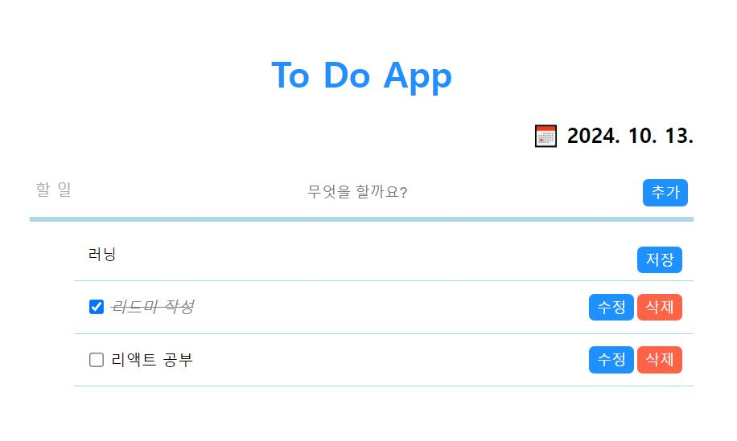

# 나만의 To Do App 만들기   
   
🚀 [To Do App 구경하기](https://to-do-app5.vercel.app/)
### ◽ 기획의도   
1. React를 통해서 기본적인 **CRUD** 구현   
2. 기본적인 React Hook 연습 
3. styled-components 적용

### ◽ 기능   
1. 할 일 추가하기   
    * 빈 문자열 추가 방지⛔    
    * enter키를 통한 편리한 추가 ▶
2. 추가한 할 일 수정하기
    * 완료작업 구분(✅)
3. 할 일 삭제하기 ❌

### ◽ 기술스택   
  * Module Bundler : create-react-app   
  * Library : React   
  * styling : styled-component